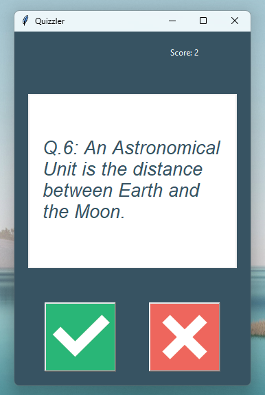
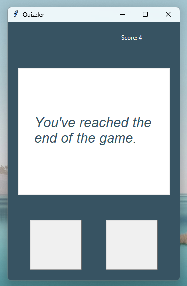
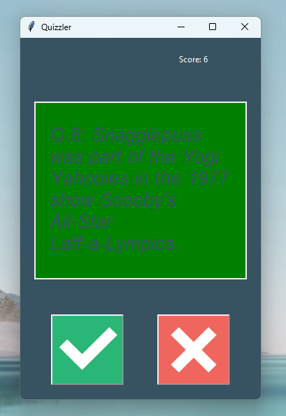
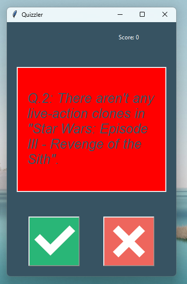

# Quizzler Project

## Introduction 🧠💪
Welcome to the Quizzler Project! This Python-powered trivia game tests your knowledge with questions fetched from the Open Trivia Database. Get ready to flex those brain muscles and embark on an exciting quiz journey! But watch out, you might get addicted to proving your trivia prowess!

## Game Mechanics ⚙️
Your mission is simple: answer as many trivia questions as you can. With the power of Python and a sleek Tkinter GUI, our game presents you with questions and keeps track of your score. Can you beat your high score? Let the quiz commence!

### Fetching Questions❓
Using the mighty requests library, our game fetches trivia questions from the vast lands of the internet (specifically, the Open Trivia Database)📂💾. We’ve got questions about everything from aardvarks🐽 to zeppelins🛸!

### GUI Magic🔮 
The game's interface is crafted with Tkinter, giving you buttons to click and questions to ponder. The interface updates dynamically based on your answers, and yes, we do give you immediate feedback. Green for correct answers✅, red for wrong ones❌ - just like traffic lights but for your brain!

### Object-Oriented Wizardry🧙‍♂️
Under the hood, the game is powered by OOP magic. Classes like Question, QuizBrain, and UserInterface make sure everything runs smoothly. It's like having a well-organized library of knowledge, but without the shushing librarian!

## Requirements📝
To dive into this trivia adventure, you’ll need:

- Python 3.x🐍
- The requests library🌐
- Tkinter (included with standard Python installations)

## Installation🛠️
Follow these steps to set up your trivia battleground:

- Clone the repository to your local machine.
- Make sure Python is installed on your system.
- Install the requests library: `pip install requests`.
- Run the `main.py` script to start the game.

## Usage💻
Here’s how to embark on your trivia quest:

1. Fire up the `main.py` script.
2. A Tkinter window will pop up with your first trivia question.
3. Answer the questions by clicking the True or False buttons.
4. Watch as the game tells you if you're right or wrong and keeps track of your score.
5. Keep answering until you run out of questions - then bask in your trivia glory!

## Configuration🔌
Tweak the game’s behavior using these parameters:
- `Number of Questions`: Change the amount parameter in data.py to set how many questions you want to fetch.
- `Question Type`: Currently set to boolean questions, but you can explore other types available in the Open Trivia Database.

## Conclusion🏆
The Quizzler project is your ticket to endless trivia fun and knowledge growth. It’s a great way to learn Python, understand APIs, and create GUIs. Ready to become a trivia master? Let the quiz begin! 🏆

